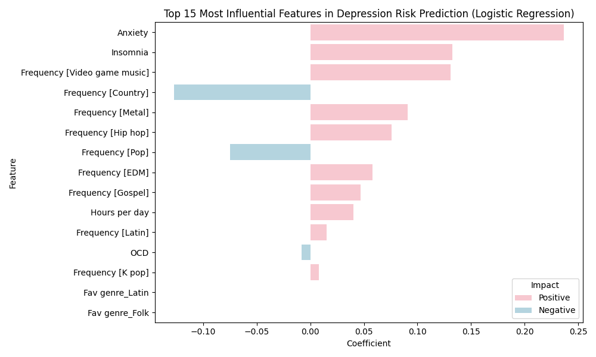
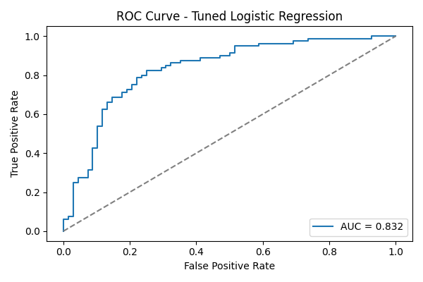
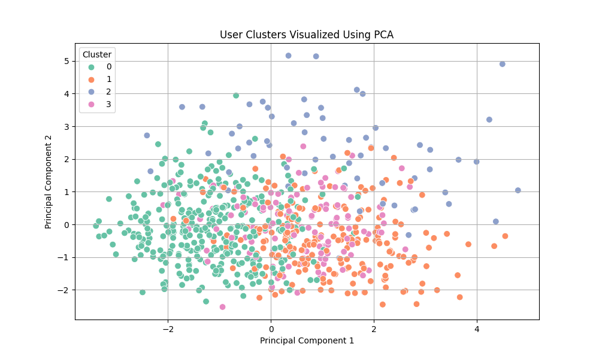

# 🎧 Music & Mental Health Analysis (ML Project)

This project explores how music listening habits relate to mental health traits like depression, anxiety, insomnia, and OCD. Using a real-world survey dataset, I applied classification and clustering techniques to derive insights into user behavior and psychological indicators.

---

## 🧠 Objectives

- Explore the relationship between music genres and mental health scores  
- Predict high-risk users for depression using logistic regression  
- Identify user clusters based on listening behavior via hierarchical clustering + PCA  

---

## ⚙️ Techniques Used

- **Supervised Learning:** Logistic Regression  
- **Unsupervised Learning:** Hierarchical Clustering + PCA  
- **Evaluation:** ROC Curve, AUC Score (LogReg), Silhouette Score (Clustering)  
- **EDA:** Visualized genre preferences, mental health distributions, and feature correlations

---

## 🔍 Key Findings

- 🎼 Genres like *Lofi* and *Classical* were linked to lower depression scores  
- 🔥 Genres like *Rap* and *Hip Hop* showed higher associations with anxiety and insomnia  
- 💡 Logistic Regression achieved an AUC of **0.83**, identifying key predictors like *anxiety*, *insomnia*, and *listening frequency*  
- 🔗 Clustering revealed interpretable genre-based groupings with a silhouette score of ~0.065

---

## 🖼️ Highlight Visualizations

| Visualization | Description |
|---------------|-------------|
|  | Top predictors for depression risk |
|  | Model performance for classification |
|  | Clusters of users based on music and mental health |
| .png) | Depression risk distribution across genres |

> 📁 *All 22 plots are available in the `/plots` folder for further exploration.*

---

## 🛠️ Tools Used

Python · Pandas · Scikit-learn · Matplotlib · Seaborn · Jupyter Notebook

---

## 📁 Repository Structure
- **data/**: CSV dataset (or placeholder)
- **notebooks/**: EDA, modeling, clustering notebooks
- **exports/**: HTML exports of notebooks
- **plots/**: 22 visualizations from analysis


---

## 🚀 How to Run

1. **Clone the repo**
   ```bash
   git clone https://github.com/YashPrajapati3000/Music_Mental_Health_Analysis_ML_Project.git
   cd Music_Mental_Health_Analysis_ML_Project
   
2. **Install dependencies:**
- Using pip:
  ```bash
  pip install -r requirements.txt

3. **Jupyter installation if you don’t already have it:**
   ```bash
   pip install jupyter
   
4. Launch notebooks and follow code blocks in order

---

## 📬 Contact

Created and maintained by [Yash Prajapati](https://github.com/YashPrajapati3000)  
For questions, feel free to open an issue or connect via GitHub.
